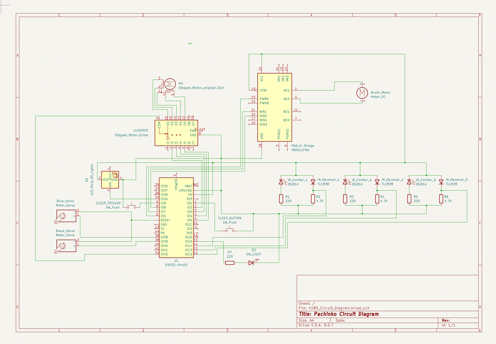
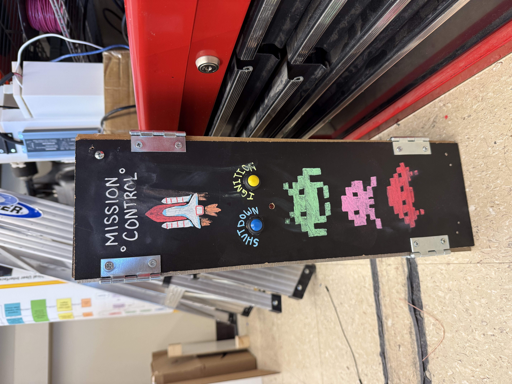
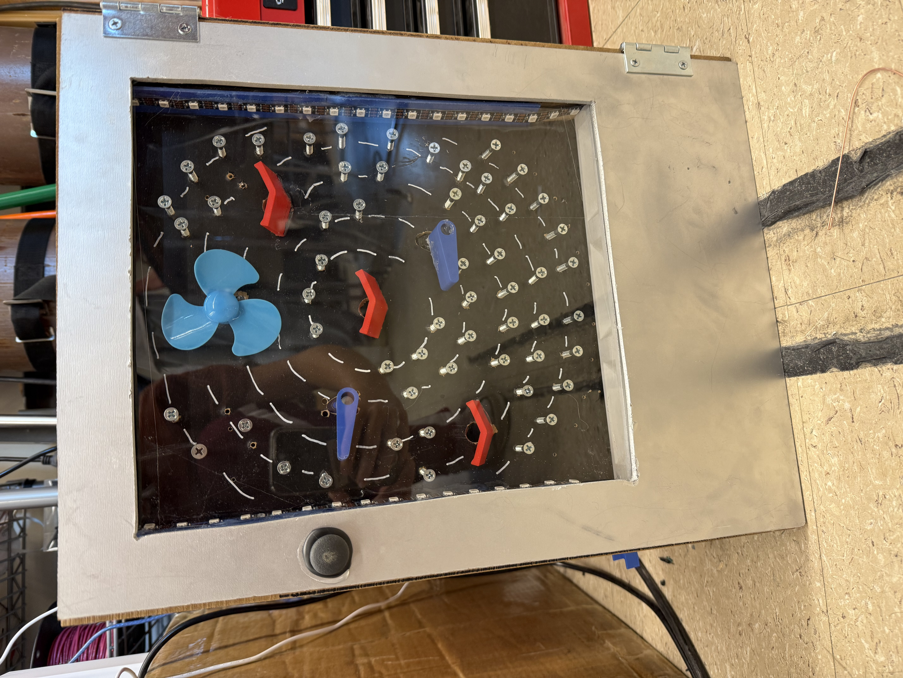
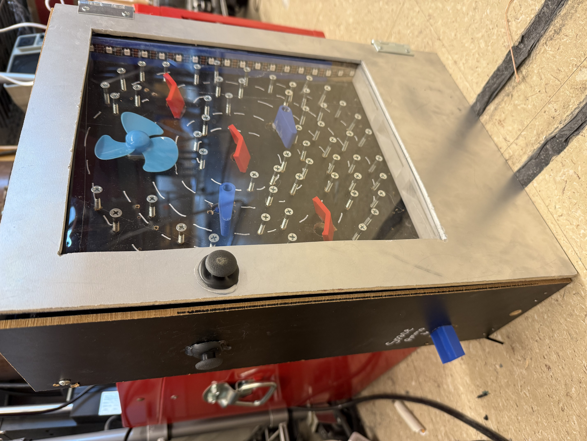
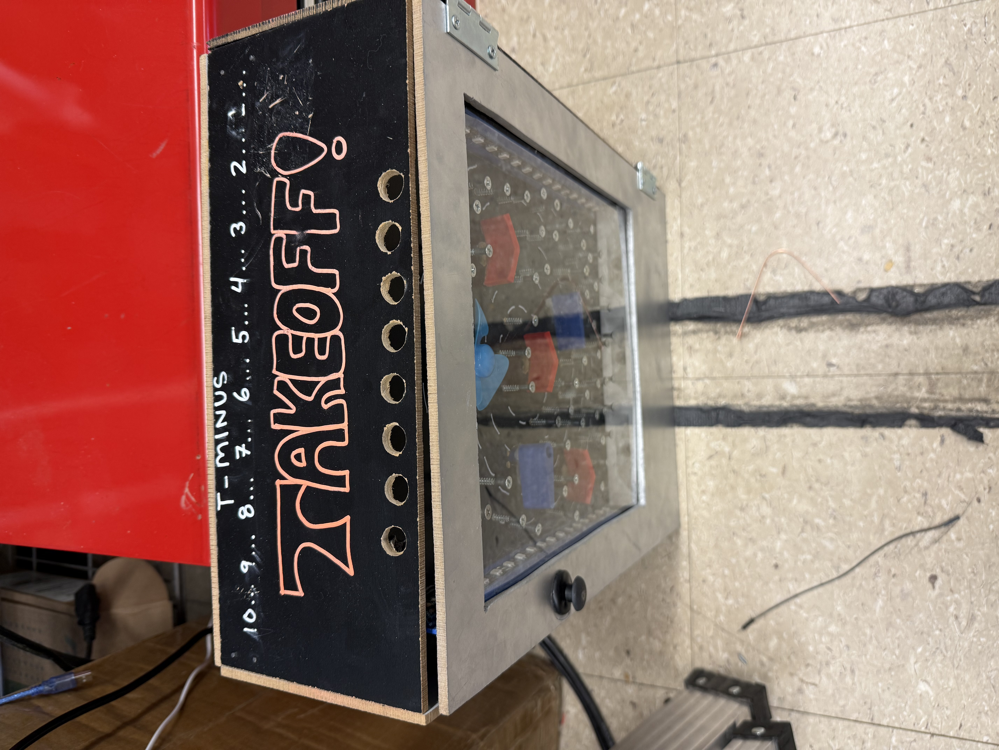

## Libraries & APIs Used

- ESP32Servo – https://github.com/madhephaestus/ESP32Servo  
- Adafruit NeoPixel – https://github.com/adafruit/Adafruit_NeoPixel  
- Preferences (ESP32 Non-Volatile Storage) – https://docs.espressif.com/projects/arduino-esp32/en/latest/tutorials/preferences.html  
- WiFi.h (ESP32 built-in library)  
- Stepper.h (Arduino built-in library)  
- ESP32 Sleep API – https://docs.espressif.com/projects/esp-idf/en/stable/esp32s3/api-reference/system/sleep_modes.html  

# ECE_4180_Final_Project

The project produced was an interactive Pachinko machine. Pachinko is a Japanese pinball machine where the player inserts pachinko balls at the top of the machine and tries to aim for inlets in the board as the ball hits pins and obstacles on the way down. In modern day, pachinko machines are often used for gambling and include slot-style games on a screen inside of the machine. However, the purpose of this project was to uphold the “vintage” style of pachinko with simple electrical components while also implementing the slot machine game through a WiFi-connected webpage.

The Pachinko machine itself was made up of three stacked panels: a back panel with the wiring, and middle panel with the gameplay and aesthetics, and a front panel for viewing. The back and front panels were attached with hinges, allowing easy access to the electronics for mechanical work. The middle panel was drilled with different sized holes to hold each of the electronics, and the pins in the board were individually screwed to give the balls extra obstacles when falling down. The extra components, such as the flippers for the servos and the wings for the point holes, were 3D printed. The bottom ball collector and the ball return were also 3D printed. The ball return was made from a stepper motor and a gear wheel, which turned 90 degrees to drop one ball onto the return ramp. The stepper motor was driven by a stepper motor driver and reacted with the sensors and at the start of the game. The board was organized to alter the difficulties of the three inlets– the top inlet was the easiest, facing only pins, the middle inlet was the most difficult, hidden by a spinning wheel, and the bottom inlet was medium difficulty, covered with pins and slowly turning flippers. 
	
At the start of gameplay for the Pachinko, the ball return would give the player 5 balls and start their score at zero. The player can join the Embedded_Pachinko WiFi network, which would allow them to see their updated score and play the casino game. The actual gameplay board contained two servo motor “flippers”, a brush motor, and three sensor inlets which would allow the user to score different numbers of points depending on the inlet. The center inlet was the “Casino Royale” section, which ran a randomized slot machine simulation on the user interface. The slot machine game entailed choosing three random numbers between zero and five, and would find how many of the three numbers were matching. Depending on how many matching numbers there were, the user would score double that number and the ball return would return that quantity. If the user’s ball returned at the bottom of the board, they would receive no points and no balls back. Throughout the entire game, an LED strip would flash different colors and react to the different sensor inputs.
	
The microcontroller used for the Pachinko machine was the ESP32 ProS3, chosen for its pin availability and its multiple cores. Because there were so many components, it was vital to have ample GPIO pins to ensure each connection could be met. With this in mind, the microcontroller was able to connect to two pushbuttons, a stepper motor driver, an h-bridge motor driver, two servos, an LED strip, an individual LED diode, and three infrared sensing systems. The components ran off of the 5V power rail, and separate ground rails were used for the motors and sensors to limit noise between the readings.
	
The code for the project used threading to separate the aesthetics and gameplay, allowing the lights, flippers, fan, ball return, and webpage to run simultaneously with the sensing. This allowed for smooth gameplay and interactive visuals that continued while the user played. However, because of the multiple cores, shared variables had to be protected by a mutex. The game had a deep sleep mode function, which allowed for the game to be turned on and off by two push buttons implemented on the side of the box. The sleep button was attached to an interrupt, meaning that the reading was not constantly polled and the user could instantaneously turn the entire system off. An LED diode by the power buttons was included to signal when the game was on or off. The high score of the game was saved in non-volatile memory, which allowed the user to keep track of their progress over multiple runs and view their score on the webpage. The webpage was implemented using embedded html code, which very simply was designed with colored boxes and text to share information. The sensor systems were run by analog inputs from infrared emitters and receivers, which would change their readings based on whether the metallic ball was run under the sensor reflecting light back. The motors were run with PWM, which allowed for the speed and movement of the motors to be controlled. The lights flashed between red, green, and blue– colors chosen because of their minimal interference with the infrared sensors– and would react differently to different inlet scores.
	
There were a few issues that came with designing the project, the most impactful being the occasional false-triggering of sleep mode. The false triggering was likely due to noise from the power and ground rails with the motors. This could have been improved upon by using separated power sources and ensuring the different power draws wouldn’t affect each other. An additional problem faced was the unequal qualities of infrared emitters and receivers, resulting in necessary individual calibration instead of a generalized sensor map. To avoid this, a future implementation could use photoresistors and a simple LED diode to better sense the lack of light as opposed to the presence of it. This would also have led to less noise in the readings from the aesthetic lights, and would allow more liberty in the physical design of the machine.
	
This Pachinko machine is different from any other because of its ability to hold the older, simpler look of moving components while combining the new-age gambling gameplay. With the WiFi connection allowing the user to keep track of score and slot runs, the game supplies a simultaneous new- and old-age gaming experience. Additionally, the use of sensors in the inlets makes for more complexity in the actual game, as the sensing system allows for the robotic ball-return to react instead of a mechanical component reacting to each score. Finally, the gameplay components were themed as “space invaders,” keeping the users attention further and drawing them into playing the game.
	
Given more time, it would be a goal to implement further sensing systems on the bottom ball return to keep track of when the user ran out of plays, instead of relying on the user to recognize that they have run out of balls. Additionally, a more extensive mechanical shooting system for the ball could be designed, allowing the user to play the ball from the bottom instead of inserting the ball at the top. Finally, because the machine was made from MDF, the material was unable to be laser cut. This resulted in less clean of a look, whereas a laser cut box would have been preferred aesthetically.

# Circuit Diagram

# Final Product

